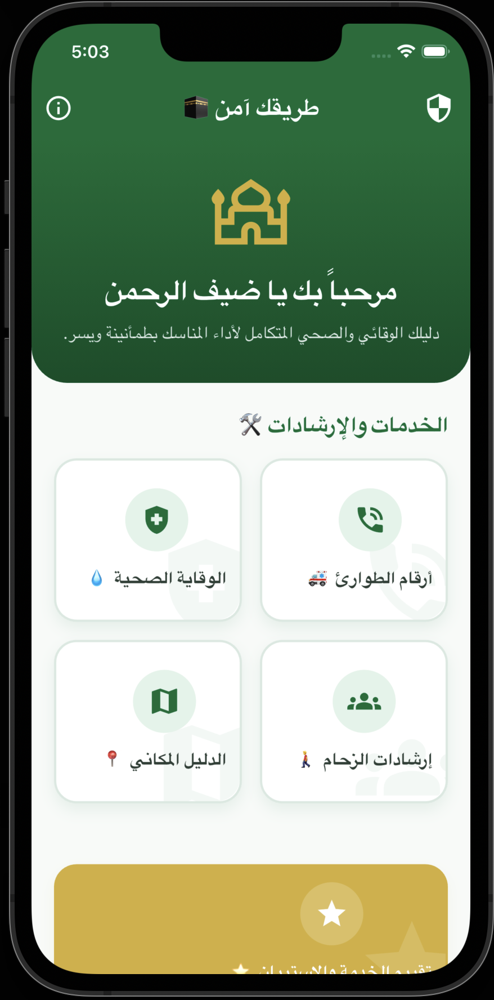
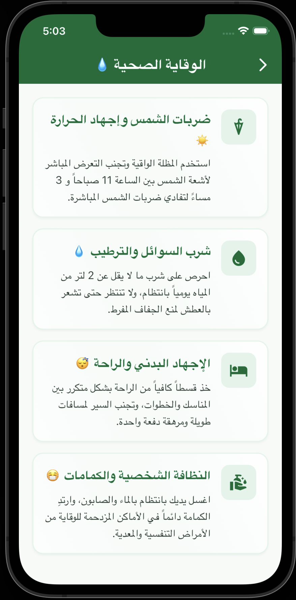
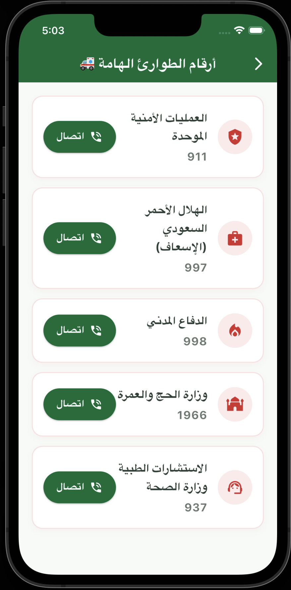
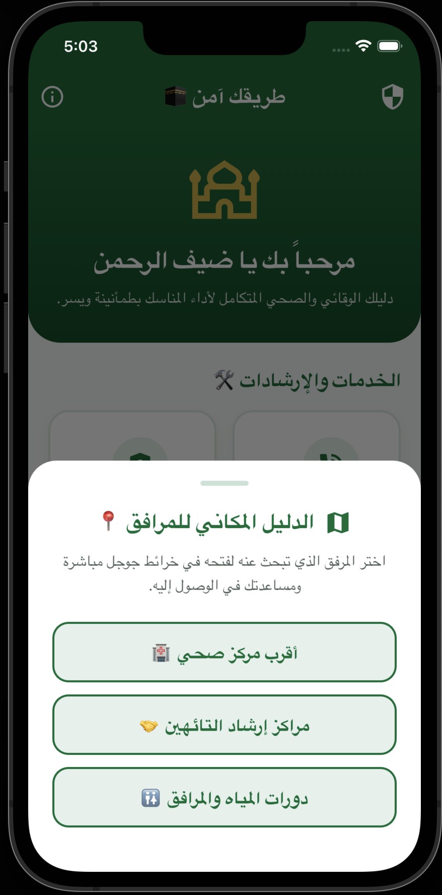
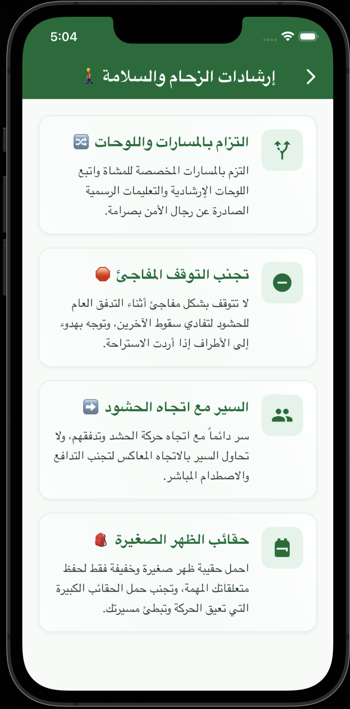

# Safe Path | طريقك آمن 🕋 🚑

**Safe Path (طريقك آمن)** is a premium, community-service Flutter mobile application designed specifically to assist, guide, and protect Hajj and Umrah pilgrims. Built with a focus on accessibility and ease of use, the app serves as an offline-first companion providing critical emergency contacts, health prevention tips, crowd control instructions, spatial guidance, and feedback loops.

<p align="center">
  
  
  
  
  
</p>

---

## 🌟 Key Features

The app is divided into five core interactive categories, designed with large tap targets, high-contrast visual cues, and universal iconography to ensure usability under high-stress conditions (ideal for elderly pilgrims):

### 1. Emergency Numbers (أرقام الطوارئ) 🚑
* **Action:** Direct, one-tap phone dialer integration.
* **Bilingual Contact List:**
  * **Unified Security Operations (العمليات الأمنية):** `911`
  * **Saudi Red Crescent/Ambulance (الهلال الأحمر):** `997`
  * **Civil Defense (الدفاع المدني):** `998`
  * **Ministry of Hajj & Umrah (وزارة الحج والعمرة):** `1966`
  * **Ministry of Health Consultations (الصحة):** `937`
* *Fallback behavior copies the number to the clipboard automatically if running on an emulator or a device without cellular capabilities.*

### 2. Health Prevention (الوقاية الصحية) 💧
* **Action:** High-visibility, themed information cards displaying vital preventative guidelines.
* **Included Tips:**
  * **Sunstroke Protection:** Recommendations to use umbrellas and avoid direct exposure between 11 AM and 3 PM.
  * **Hydration:** Advice to drink at least 2 liters of water daily without waiting for thirst.
  * **Physical Exhaustion:** Reminders to rest frequently between rituals and avoid walking excessive distances continuously.
  * **Hygiene:** Instructions on regular handwashing and wearing masks in congested zones.

### 3. Crowd Guidelines (إرشادات الزحام) 🚶‍♂️
* **Action:** Easily readable guideline cards advising on pedestrian safety.
* **Included Tips:**
  * **Path Adherence:** Instructions to stick strictly to designated paths and security signs.
  * **No Sudden Stops:** Guidance to step to the outer edges before resting to prevent pileups.
  * **Flow Movement:** Warnings against walking in the opposite direction of moving crowds.
  * **Luggage Limits:** Encouragement to carry only small backpacks to ensure ease of movement.

### 4. Spatial Guide (الدليل المكاني) 📍
* **Action:** Opens a bottom sheet displaying map indicators that launch directly into Google Maps coordinates:
  * Nearest Health Center (أقرب مركز صحي)
  * Lost & Found Centers (مراكز إرشاد التائهين)
  * Restrooms & Facilities (دورات المياه والمرافق)

### 5. Rate the Service (تقييم الخدمة) ⭐
* **Action:** A visually highlighted, featured item on the main dashboard that opens a dedicated feedback questionnaire (e.g., Google Forms) to gather pilgrim experiences for continuous app improvements.

---

## 🛠️ Architecture & Premium Design

* **Material 3 Theme:** Uses custom primary Emerald Green (`#006C35`) and warm spiritual Gold (`#D4AF37`) accents suitable for a medical and guidance app.
* **Offline-First:** All content is packaged locally, ensuring the application remains fully functional in crowded areas with poor or non-existent cellular reception.
* **Accessibility-First UI:** Large tap targets, minimum interactive heights of `56px`-`60px`, and clear Arabic typography with full Right-to-Left (RTL) support.
* **Clean Code Structure:** Separated into independent widgets (`CategoryGridItem`, `TipCard`, `EmergencyContactTile`) and centralized theme constants (`AppTheme`).

---

## ⚙️ Configuration & Setup

### Dependencies (`pubspec.yaml`)
The project utilizes the following core packages:
```yaml
dependencies:
  flutter:
    sdk: flutter
  cupertino_icons: ^1.0.8
  url_launcher: ^6.2.5
  flutter_localizations:
    sdk: flutter
```

### Platform-Specific Setup (Critical for URL Launching)

To support opening phone dialers (`tel:`) and web/map links (`https:`), the following configuration has been applied:

#### 1. Android Configuration
In `android/app/src/main/AndroidManifest.xml`, the following `<queries>` tags are specified to whitelist outgoing intents:
```xml
<queries>
    <!-- Support url_launcher phone calls -->
    <intent>
        <action android:name="android.intent.action.DIAL" />
        <data android:scheme="tel" />
    </intent>
    <!-- Support url_launcher web links -->
    <intent>
        <action android:name="android.intent.action.VIEW" />
        <data android:scheme="https" />
    </intent>
</queries>
```

#### 2. iOS Configuration
In `ios/Runner/Info.plist`, the schemes are registered under `LSApplicationQueriesSchemes`:
```xml
<key>LSApplicationQueriesSchemes</key>
<array>
    <string>tel</string>
    <string>https</string>
</array>
```

---

## 🚀 Getting Started

To run the application locally on your machine, follow these steps:

1. **Clone the Repository:**
   ```bash
   git clone <repository-url>
   cd SafePath
   ```

2. **Fetch Dependencies:**
   ```bash
   flutter pub get
   ```

3. **Verify Device Connection:**
   Ensure you have a simulator running or a physical device connected:
   ```bash
   flutter devices
   ```

4. **Run the Project:**
   ```bash
   flutter run
   ```

---

## 🕋 About the Initiative
Developed as a dedicated community service initiative, **Safe Path** aims to provide peace of mind to pilgrims performing their sacred duties, combining modern mobile technology with essential healthcare and safety instructions.

*حجٌّ مبرور وسعيٌ مشكور وذنبٌ مغفور بإذن الله.*
